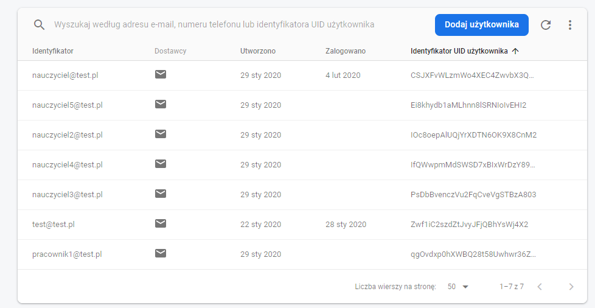
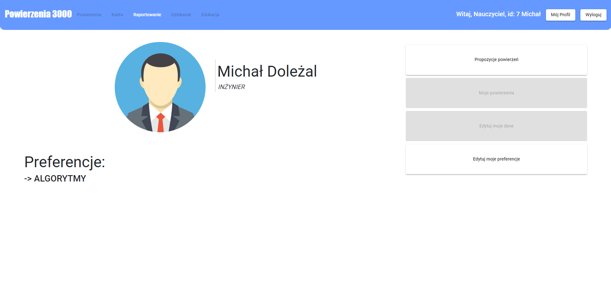
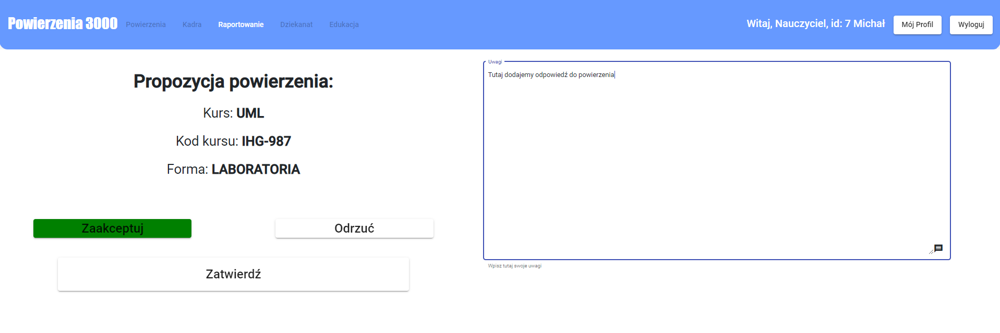
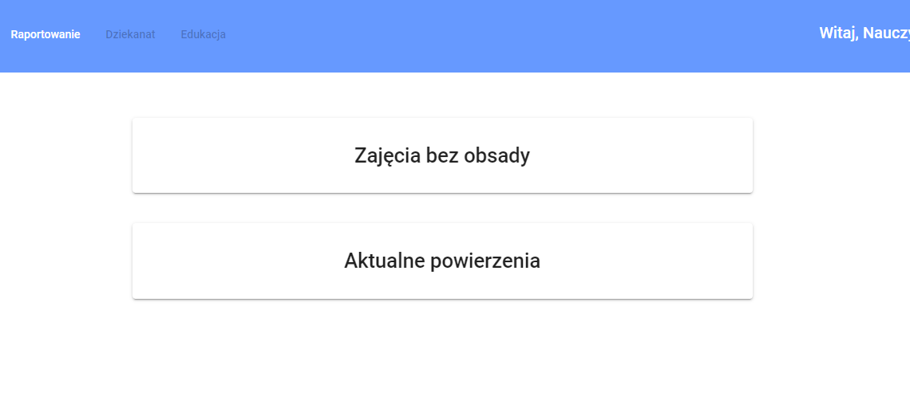

# Planowanie powierzeń dla kierunku
> **Grupa**: 
> * 228109 - *Paweł Głuszczak* 
> * 228043 - *Marcin Szeptun*
> * 228068 - *Tomasz Mosur*

# Wybrane wymagania
## Funkcjonalne
* Powiadomienie o powierzeniach i ich aktualizacjach (np. wiadomości wysyłane do opiekunów kursu o zmianie obsady zajęć towarzyszących). Zatwierdzanie/Sugestie zmian w propozycji powierzeń. 
* Definicja preferencji przez pracowników.
* Raportowanie: zajęć bez obsady, aktualnych powierzeń pracowników, aktualnych planów zajęć pracowników 

## Niefunkcjonalne
* Logowanie on-site,
* Dwie wersje językowe interfejsu użytkownika: polski i angielski

# Dodatkowe informacje
> Jest to sekcja skracająca zaimplementowane lub użyte techniki, które wykraczają poza wymagania wymienione wyżej. Poszczególne aplikacje składające się na system opisane są niżej. [Implementacja systemu](#implementacja-systemu)

* System wykorzystuje zewnętrzy sytem autoryzacyjny : `Firebase Authentication`
* System zbudowany jest w stylu 3 warstwowym:
    * Baza danych MySQL *[Więcej](#baza-danych)*
    * Serwis webowy z użyciem Angular 8 *[Więcej](#front-end)*
    * REST API z użyciem Spring Boota *[Więcej](#back-end)*
* Każda warstwa systemu budowana jest z osobnego obrazu dockerowego, po czym całośc uruchamiania jest za pomocą skryptu docker-compose.
* Aplikacja front-endowa budowana jest w dwóch wersjach. W wersji polskiej oraz angielskiej. Z użyciem odpowiedniego adresu URL wybierana jest wersja językowa strony
* Aplikacja back-endowa posiada przykładowe testy jednostkowe sprawdzające działanie wrażliwych punktów aplikacji.
* Dodatkowo, została przygotowana konfiguracja środowiska Kubernetesa dla systemu. Pliki konfiguracyjne znajdują się w folderze app/k8s.

# Metodyka DevOps
Skonfigurowano środowisko ciągłej integracji Travis, które przy każdej zmianie w repozytorium uruchamia testy jednostkowe zarówno warstwy backendowej jak i frontendowej. Travis informuje każdego developera o każdym niepomyślnym wykonaniu testów.

# Architektura Docker

# Architektura Kubernetes

# Uruchamianie aplikacji
Aby uruchomić aplikację należy uruchomić skrypt run-docker.sh znajdujący się w folderze app. Aplikacja po uruchomieniu będzie dostępna pod adresem localhost na porcie 80.

# Implementacja systemu
## Baza danych
Jako silnik bazy danych wybrano MySQL w wersji 8.0.18. 

## Front-end
### Ekran główny - logowanie
Uruchamiając aplikację po raz pierwszy, od użytkownika wymaga się aby wpisał dane logowania do systemu. W widocznej niżej sekcji podaje on swój login i hasło, które identyfikuje go w systemie jako użytkownika. Logowanie następuje z wykorzystaniem Firestore. Tam przechowywane są dane o użykowniku, które po otrzymaniu w aplikacji pozwalają na zidentyfikowanie go w lokalnej bazie danych za pomocą `databaseId`.

*Konta użytkowników*

*Dane zapisywane w firebase - odwzorowanie konta firestore na informacje w lokalnej bazie danych*

*Logowanie do aplikacji*

Po zalogowaniu się do aplikacji użytkownik z każdym następnym wejściem do niej, o ile się nie wyloguje, będzie już logowany automatycznie.

W tym momencie użytkownik może już korzystać z aplikacji.

*Dane dotyczące zalogowanego użytkownika*

Po wejściu w mój profil dostępne są dla użytkownika następujące opcje, spełniające wymagania funcjonalne *[Wymagania funkcjonalne](#funkcjonalne)*

### **Propozycje powierzeń**
Użykownik otrzymuje w tym miejscu listę powierzeń, które go dotyczą. Może z każdym powierzeniem podjąć trzy akcje :
* **\+**  -> zaakceptuj powierzenie
* **\-**  -> odrzuć powierzenie
* **i**   -> wejdź w szczegóły

*Lista proponowanych powierzeń*

Ostatnia opcja przeniesie użytkownika do odpowiedniej sekcji, gdzie wyświetlone zostaną szczegóły powierzenia oraz więcej możliwości reagowania na powierzenie.

*Szczegóły powierzenia*

W tym miejscu użytkownik musi wybrac czy akceptuje czy odrzuca powierzenie oraz dodać ewentualne uwagi do powierzenia. Opcja `zatwierdź` dostępna jest tylko gdy wybrana zostanie jakaś akcja.

Wybrana akcja zaktualizuje stan powierzenia w bazie danych

### **Edytuj powierzenia**

W tym miejscu wyświetlone zostaną aktualne preferencje użytkownika. Może on je usunąć lub dodać nowe z predefiniowanej listy pobranej z bazy danych. Opcja `zatwierdź` dostępna będzie tylko gdy zostały zrobione jakieś zmiany.

*Edytowanie preferencji użytkownika*

`Zatwierdź` zaktualizuje preferencje użytkownika w bazie danych jak i "na żywo" w aplikacji.

### Raportowanie
Po wybraniu tej opcji użykownikowi wyświetlone zostaną dwie kategorie raportów, które może wyświetlić
* Zajęcia bez obsady 
* Aktualne powierzenia 

*Możliwe raporty*

Po wybraniu jednej z opcji użytkownikowi wyśtwieli się pobrana lista odpowiednich danych z bazy danych

*Przykładowa lista przedmiotów, które nie mają jeszcze przypisanych powierzeń*

### Dwie wersje językowe

Do aplikacji można po zbudowaniu dostać się za pomocą dwóch ścieżek. 
 * http://localhost/pl/ - ten link przekieruje użytkownika na wersję polską strony 

*Raport aktualnych powierzeń w wersji polskiej*

 * http://localhost/en/ - ten link przekieruje użytkownika na wersję polską strony 

*Raport aktualnych powierzeń w wersji angielskiej*

> Na potrzeby projektu przetłumaczone zostały tylko wybrane informacje!

Dane w różnych wersjach językowych to niektóre dane statyczne jak nazwa aplikacji i opcje w nagłówkach oraz ładowane na podstawie wybranego języka dane dynamiczne jak nazwy kursów, które posiadają w bazie danych odpowiednie dla języków translacje.

## Back-end

Warstwa Backendowa została zaimplementowana zgodnie z diagramem pakietów zawartych w dokumentacji projektu

W wyniku implementacji powstały następujące controllery i ich metody:
* course - localhost/course/
  * GET/{courseCode} - pobranie informacji o kursie szukając po jego kursie
  * GET/translation/lang/{languageCode} - pobranie o danych kursów wraz z ich translacjami za pomocą kodu języka (PL lub EN)
  * GET/translation/{id}/{languageCode} - pobranie informacji o danych kursu w wybranym języku
  * POST/add - dodanie nowego kursu do bazy danych
* entrustment - localhost/entrustment/
  * GET/id/{id} - pobranie informacji o powierzeniu na podstawie id
  * GET/status/{status} - pobranie informacji o powierzeniach na podstawie ich statusu
  * PUT/update - aktualizacja powierzenia znajdującego się juz w bazie danych
  * POST/add - dodanie nowego powierzenia do bazy danych
* lecturer - localhost/lecturer
  * GET/surname/{surname} - pobranie informacji o nauczycielach na podstawie nazwiska
  * GET/id/{id} - pobranie informacji o nauczycielu na podstawie id
  * GET/all - pobranie informacji na temat wszystkich nauczycieli
  * PUT/update - aktualizacja danych nauczyciela znajdującego się już w bazie danych
  * POST/add - dodanie nowego nauczyciela do bazy danych
* knowledge area - localhost/knowledge
  * GET/name/{name} - wyszukanie obszaru wiedzy na podstawie jego nazwy
  * GET/lecturer/{id} - wyszukanie obszaru wiedzy na podstawie nauczyciela, który je posiada
  * GET/all - pobranie wszystkich dostępnych obszarów wiedzy
  * POST/add - dodanie nowego obszaru wiedzy do bazy danych
* raport - localhost/raport
  * GET/free - pobranie wszystkich powierzeń bez przydzielonych prowadzących
  * GET/list/{id} - pobranie powierzeń przydzielonych do prowadzącego
  * GET/all - pobranie wszystkich powierzeń z bazy danych

Oraz większością encji zawartych w diagramie bazy danych (nie uwzględniono encji, które nie były konieczne w implementowanych wymaganiach)

Przy starcie applikacji i inicjalizacji bazy danych tworzone są przykładowe dane, aby mogły być one użyte w warstwie front-endowej.
